<p align="right"><a href="README_CN.md">中文</a> | English</p>

<div align="center">
  <h1>arb</h1>
  <p><em>Fast by default. Deep when you need it.</em></p>
  <p>A GPU-accelerated macOS terminal with a built-in shell suite.<br />Zero config. Zero plugins. Just open and code.</p>
</div>

<p align="center">
  <a href="LICENSE"></a>
  
  <a href="https://github.com/szj2ys/arb/stargazers"></a>
  <a href="https://github.com/szj2ys/arb/releases/latest"></a>
  <a href="https://github.com/szj2ys/arb/releases"></a>
  <a href="https://github.com/szj2ys/arb/actions"></a>
</p>

<p align="center">
  
  
  
  
</p>

<div align="center">
  <br />
  
  <br />
  <sub>arb with Starship prompt, syntax highlighting, and smart directory navigation</sub>
  <br /><br />
</div>

<p align="center">
  <a href="https://szj2ys.github.io/arb/">
    <strong>See it in action &rarr;</strong>
  </a>
</p>

---

## Features

- **Zero Config** -- Polished defaults with JetBrains Mono, Arb Dark theme, optimized macOS font rendering, and smooth animations. Just open and start working.
- **Built-in Shell Suite** -- Pre-loaded with Starship, z, Delta, syntax highlighting, autosuggestions, and autocompletions. No plugins to install.
- **Fast & Lightweight** -- ~40 MB binary, instant startup, lazy loading, and a stripped-down GPU-accelerated core.
- **Lua Scripting** -- Full Lua scripting support for infinite customization when you need it.

---

## How arb compares

|  | arb | iTerm2 | Alacritty | Kitty | Ghostty | Warp |
| :--- | :---: | :---: | :---: | :---: | :---: | :---: |
| **Zero Config** | Yes | No | No | No | No | Partial |
| **Built-in Shell Tools** | Yes | No | No | No | No | Partial |
| **GPU Rendering** | Yes | Partial | Yes | Yes | Yes | Yes |
| **Lua Scripting** | Yes | No | No | Yes | No | No |
| **No Login Required** | Yes | Yes | Yes | Yes | Yes | No |
| **Open Source** | Yes | Yes | Yes | Yes | Yes | No |
| **Binary Size** | ~40 MB | ~55 MB | ~15 MB | ~30 MB | ~15 MB | ~90 MB |
| **Shell Boot** | ~100ms | ~250ms | ~120ms | ~130ms | ~110ms | ~200ms |

arb is the only terminal that ships with a full shell suite (Starship, z, Delta, syntax highlighting, autosuggestions) out of the box -- no plugins, no dotfile surgery, no package manager dance.

---

## Why arb?

### Your new machine is ready in one command

Most terminals require you to install a prompt, a fuzzy finder, syntax highlighting, completions, and a better diff pager -- separately. arb bundles all of these as a built-in shell suite. Run `brew install szj2ys/arb/arb`, open the app, and your shell is fully equipped.

### Built for AI coding workflows

AI-assisted development means more tabs, more split panes, more context switching. arb launches instantly (~100ms shell boot), supports native multi-tab and split-pane workflows, and stays out of your way so you can focus on the conversation between you and your AI tool.

### Customize only when you want to

arb ships opinionated defaults (JetBrains Mono, Arb Dark, smooth animations) that work well for most developers. When you do want to change something, a single Lua config file at `~/.config/arb/arb.lua` gives you full control -- no scattered dotfiles, no plugin managers, no dependency chains.

### Performance

| Metric | Typical terminal | arb | How |
| :--- | :--- | :--- | :--- |
| **Executable Size** | ~67 MB | ~40 MB | Aggressive symbol stripping & feature pruning |
| **Resources Volume** | ~100 MB | ~80 MB | Asset optimization & lazy-loaded assets |
| **Launch Latency** | Standard | Instant | Just-in-time initialization |
| **Shell Bootstrap** | ~200ms | ~100ms | Optimized environment provisioning |

---

## Quick Start

### Install

```bash
brew install szj2ys/arb/arb
```

Or download the latest `.dmg` from [Releases](https://github.com/szj2ys/arb/releases) and drag to Applications.

The app is notarized by Apple, so it opens without security warnings.

### Try it

```bash
# Smart directory jumping (learns your habits)
z projects    # jump to ~/projects instantly

# Beautiful git diffs with Delta (automatic)
git diff

# Starship prompt shows git status, versions, execution time — already working
```

### What happens on first launch

1. arb detects your shell (zsh) and installs its built-in shell suite -- Starship prompt, z directory jumper, Delta diff pager, syntax highlighting, and autosuggestions.
2. A minimal configuration block is added to your `.zshrc`. arb only appends; it does not overwrite your existing config.
3. Everything is ready. Open a new tab and you have a fully equipped shell.

### Useful commands

```bash
arb doctor   # Check that your shell integration is healthy
arb update   # Check for and apply updates from the CLI
arb reset    # Remove arb-managed shell config (--yes for non-interactive)
```

---

## Built-in Tools

arb comes with a carefully curated suite of CLI tools, pre-configured for immediate productivity:

| Tool | Description |
| :--- | :--- |
| :rocket: **Starship** | Fast, customizable prompt showing git status, package versions, and execution time |
| :zap: **z** | Smarter cd command that learns your most used directories for instant navigation |
| :art: **Delta** | Syntax-highlighting pager for git, diff, and grep output |
| :pencil2: **Syntax Highlighting** | Real-time command validation and coloring |
| :bulb: **Autosuggestions** | Intelligent, history-based completions similar to Fish shell |
| :package: **zsh-completions** | Extended command and subcommand completion definitions |

<details>
<summary><strong>Keyboard Shortcuts</strong></summary>

arb comes with intuitive macOS-native shortcuts:

| Action | Shortcut |
| :--- | :--- |
| New Tab | `Cmd + T` |
| New Window | `Cmd + N` |
| Split Pane Vertical | `Cmd + D` |
| Split Pane Horizontal | `Cmd + Shift + D` |
| Zoom/Unzoom Pane | `Cmd + Shift + Enter` |
| Resize Pane | `Cmd + Ctrl + Arrows` |
| Close Tab/Pane | `Cmd + W` |
| Navigate Tabs | `Cmd + [`, `Cmd + ]` or `Cmd + 1-9` |
| Navigate Panes | `Cmd + Opt + Arrows` |
| Clear Screen | `Cmd + R` |
| Font Size | `Cmd + +`, `Cmd + -`, `Cmd + 0` |
| Smart Jump | `z <dir>` |
| Smart Select | `z -l <dir>` |
| Recent Dirs | `z -t` |

</details>

---

## Configuration

### Customization

arb is fully configurable via standard Lua scripts.

On macOS, bundled defaults in `arb.app/Contents/Resources/arb.lua` are fallback only, so user config is loaded first.

Use a single user config path: `~/.config/arb/arb.lua`.

### Updates & Reset

- Check/apply update from CLI: `arb update`
- Remove arb-managed shell defaults and integration: `arb reset` (or non-interactive `arb reset --yes`)
- GUI auto-update check uses numeric version comparison (for example `0.1.10` is correctly newer than `0.1.9`).

---

## Support

- If arb helped you, star the repo or share it with friends.
- Got ideas or found bugs? Open an issue/PR or check [CONTRIBUTING.md](CONTRIBUTING.md) for details.

---

## License

arb is licensed under the MIT License. See `LICENSE`.
